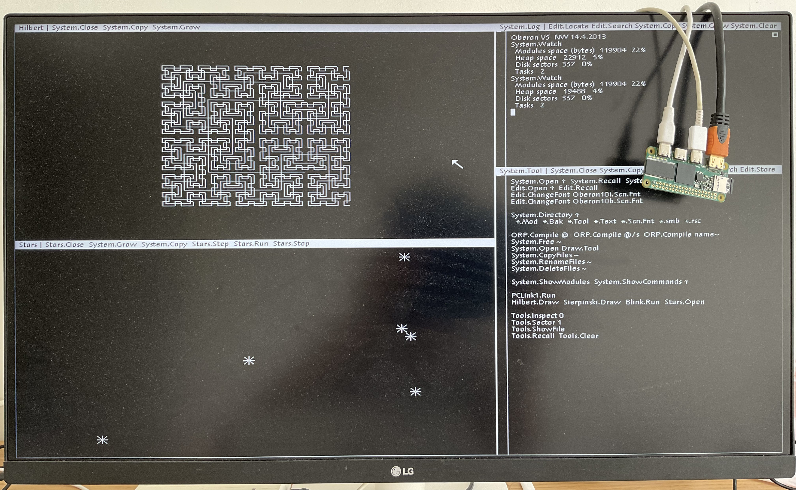

# Icepi Zero - The portable FPGA development board

| Get your own on: | [**Crowd Supply**](https://www.crowdsupply.com/icy-electronics/icepi-zero)! |
| ---------------- | ------------------------ |

## What is the Icepi Zero?

The Icepi Zero is an FPGA development board in the popular Raspberry Pi Zero form factor. It carries a Lattice ECP5 25F, enabling powerful designs while keeping a small portable size. It also has a GPDI mini (General Purpose Display Interface, same as the one on the Pi Zero) port allowing easy digital video output.

## Why Icepi Zero?

Currently most powerful FPGA boards on the market are expensive and bulky.

I've always wanted a low-cost portable FPGA with video output to make my own CPU, but there isn't any on the market.

The Icepi Zero aims to fix this. Carrying a powerful ECP5 FPGA on a small Raspberry Pi Zero form factor, it is the ultimate portable solution for FPGA development. Additionally packing a GPDI mini port and 3 USB-C ports, it allows interfacing with multiple external I/O devices.

Icepi Zero is for everyone: Students can use it to learn about the internals of modern processors. Gamers can use it to emulate old hardware. Programmers can use it to test their code on multiple architectures.

Oberon running on Icepi Zero

Icepi Zero also has an on-board USB to JTAG converter, so no external programmers are needed.

Moreover Icepi Zero is fully open-source, no strings attached. Learn from the design! ([OSHWA cerified FR000026](https://certification.oshwa.org/fr000026.html)).

## Features

- Raspberry Pi Zero form factor
- Lattice ECP5U FPGA:
    - 24k LUT
    - 112 KiB of RAM
- One MiniGPDI connector (it's HDM- but I don't have the money to buy a license...)
- Three USB-C Ports
- 256Mbit 166MHz SDRAM
- MicroSD card slot
- On-board USB to JTAG and UART converter
- 50MHz external oscillator
- 128 Mbit of flash
- 4 user LEDs
- 1 user button

This powerful configuration allows the PCB to be used in numerous ways, including real time video processing, hardware AI acceleration and prototyping of ASICs. 

## Emulation

Over the course of multiple weeks, multiple emulation cores have been ported over, such as the [Oberon](https://github.com/cheyao/oberon), [Apple I](https://github.com/cheyao/apple-one) and the [Acorn Atom](https://github.com/cheyao/acorn_atom)! The Icepi Zero allows you to take cycle accurate replicas of your favourite systems in your pocket.

Apple I running on the Icepi

Acorn Atom running on the Icepi

## Learning

It is also supported by icestudio (custom fork: https://github.com/cheyao/icestudio), allowing easy access for beginners.

## Usage

Check out the `firmware` folder for example code and compilation instructions!

If you want to order this board, it uses a 1.2mm/1.6mm PCB with JLC04121H-7628 Stackup. Gerbers are in the `production` folder in the `hardware` directory.

For the PCB, the smallest component size is 0201 for 27 Ohm resistors on the USB-C datalines. But if you want only 0402 components, just delete those 0201 resistors and you will be fine.

NOTE: If you fabbed v1.1 before 01/06, the pins of the USB pullups and LED0 is different - check your gerbers.

[View PCB online](https://kicanvas.org/?github=https%3A%2F%2Fgithub.com%2Fcheyao%2Ficepi-zero%2Ftree%2Fmain%2Fhardware%2Fv1.2)

## Contact

If there is any questions DM `@Cyao` on Hackclub Slack or `cyao.` on Discord. Mail is also accepted at `cyao _at_ duck.com`.

