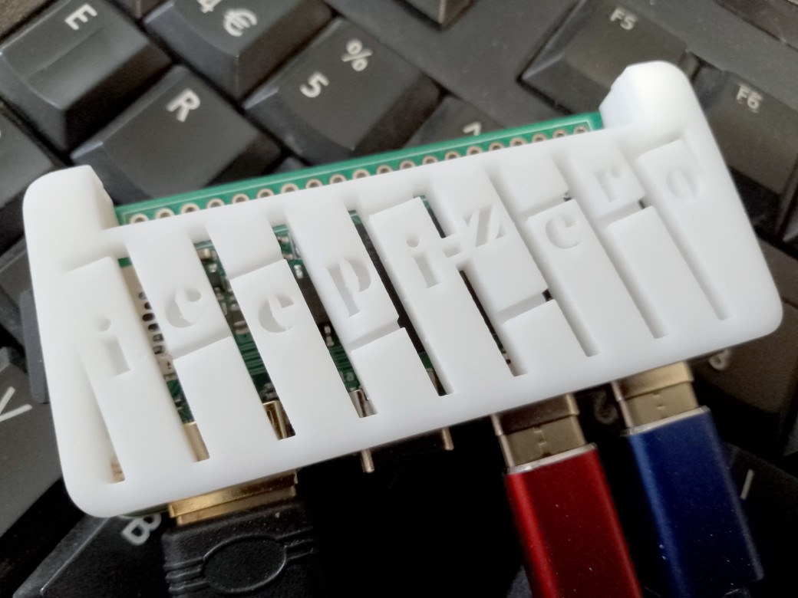
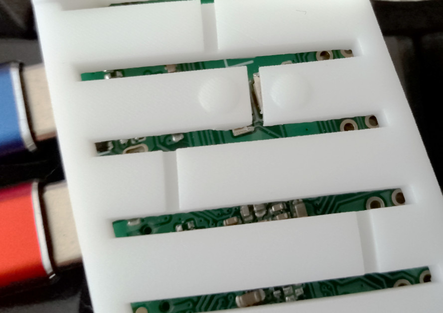

# 3D Printable case for the IcePi-Zero
by Alastair M. Robinson

This case was designed as a series of horizontal slices using InkScape
and assembled into a 3D-printable design using TinkerCAD.

The case in the photo was 3D-printed by JLC3DP. The design has been tweaked
slightly since then to improve the printability of the finer details in the
text. It's probably still fine enough to cause DRC issues, but any defects
there should be purely cosmetic and not really noticeable.

The icepi-zero has a pair of buttons on the underside, and the design of the
case incorporates a pair of spurs which will allow the buttons to be pressed
once assembled.

### License
Design files are released under the [Creative Commons CC-BY-SA-NC license.](https://creativecommons.org/licenses/by-nc-sa/4.0/)
and are provided with no warranty of any kind. Any use is at your own risk.

