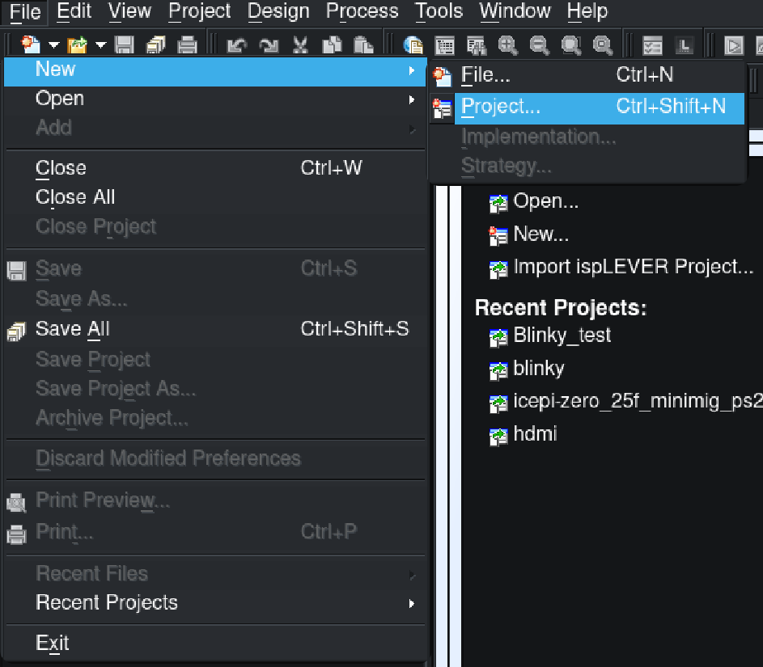
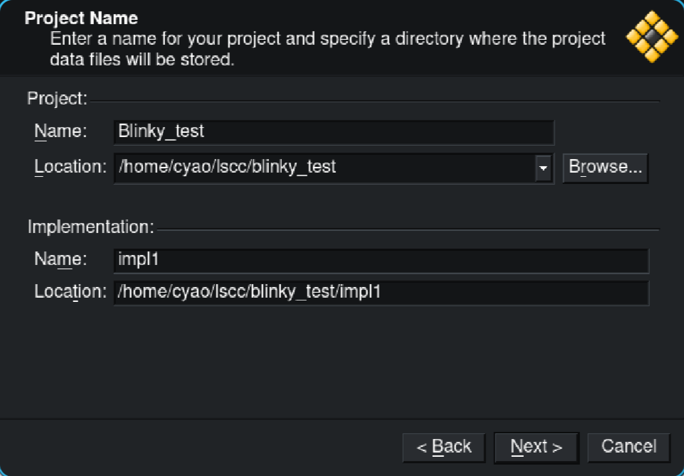
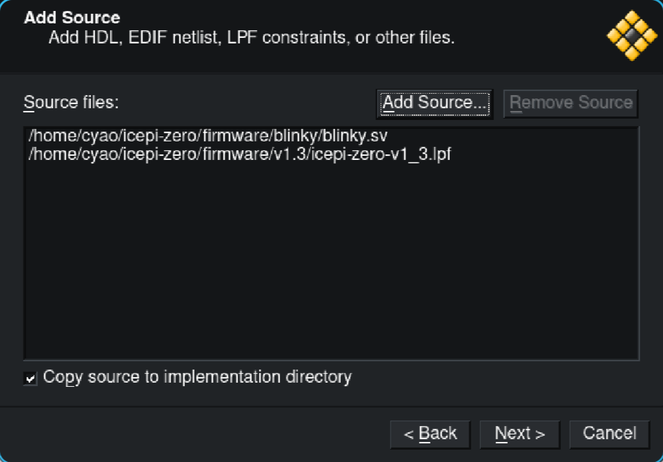
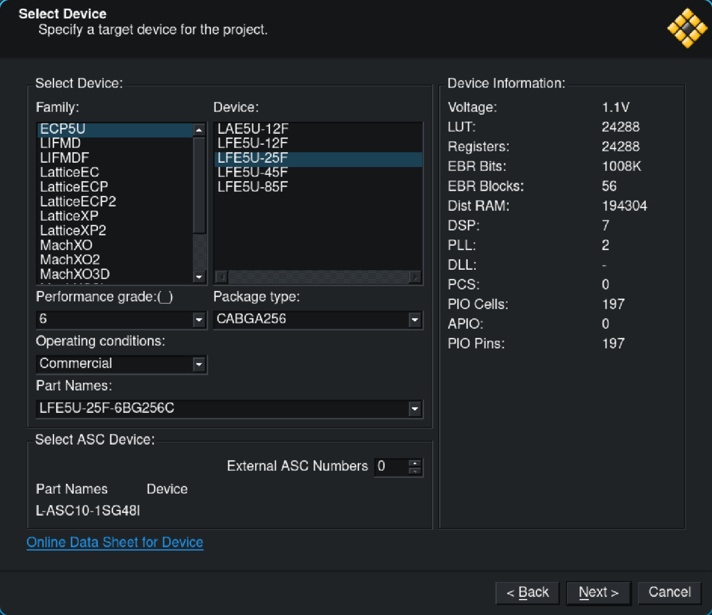
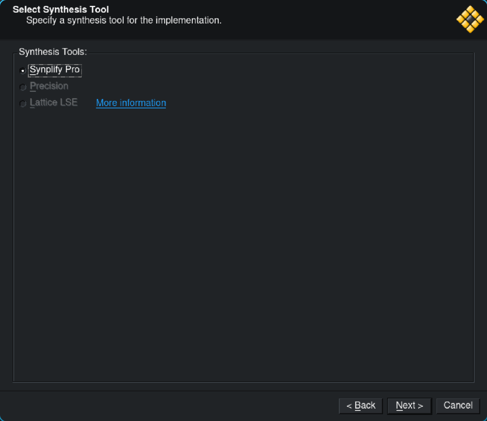
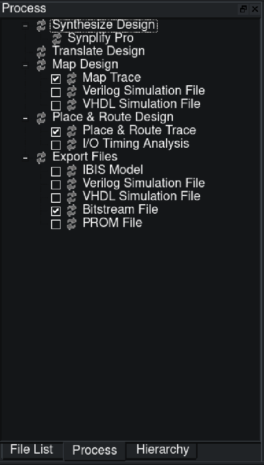
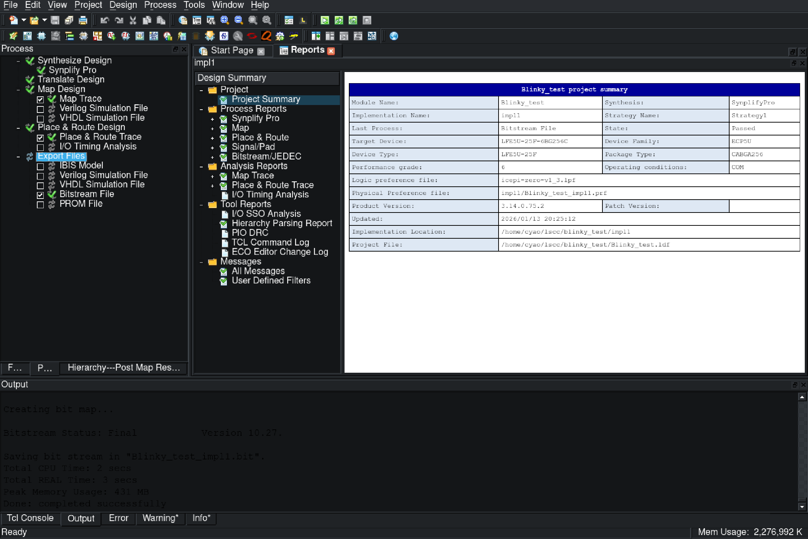

# How to use Lattice Diamond

## Obtain a License

To use the Diamond IDE, you must first request a license. (Free for individuals.)

Go to the [licensing page](https://www.latticesemi.com/Support/Licensing/DiamondAndiCEcube2SoftwareLicensing/DiamondFree?url=%2fSupport%2fLicensing%2fDiamondAndiCEcube2SoftwareLicensing%2fDiamondFree&tracker=login) and create an account. Then copy your device's MAC address, remove all colons and enter it into the "Host NIC" field. Click "Generate License". You should receive a license in your email after a few minutes.

After that, go to Diamond IDE's [download page](https://www.latticesemi.com/LatticeDiamond), install it following their instructions and select the license file when prompted.

## Creating a project

Open up Diamond IDE! If you are on linux, you should have an executable named `diamond` in the `diamond/3.14/bin/lin64/` folder of your instalation.

Now click on `File > New > Project...` and a new window should pop up.

Now follow the menu while configuring your project:

For sources, you don't need to add the Makefile, only your HDL sources and the lpf file. Do **NOT** add the pll.sv generated by `ecppll`, it isn't compatiable with Diamond IDE. To use a pll you need to generate an IP using the Clarity Designer inside the IDE.

This is what would need to be selected for the blinky project:

(Note: to select the lpf you need to change "Files of type" in the file selector to all files)

Now you need to select the device. For the Icepi Zero, choose "ECP5U" as the family, "LFE5U-25F" as the device and make sure to select "CABGA256" as the package type.

Click next, now on the left panel switch to the process tab, and check everything like this:

Double click "Export Files", and all the processes should run one by one. When everything has finished running, you should be left with a file named "Blinky_test_impl1.bit" in the "impl" folder, which can be flashed onto the board:

Unfortunetly Diamond IDE doesn't support the FT231XQ chip that the board uses, so you need to use `openFPGALoader` ([Github](https://github.com/trabucayre/openFPGALoader), contained in oss cad suite) to flash the bitstream onto the board.

Happy hacking!
