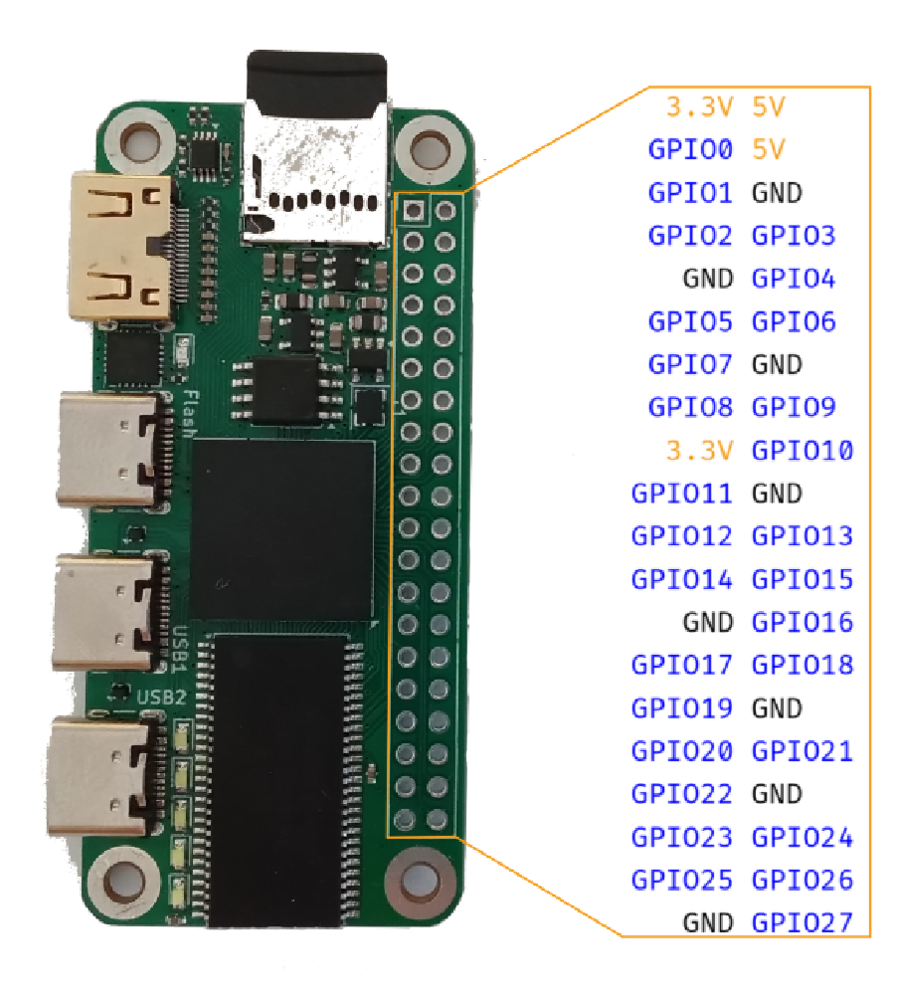

# Icedev Zero Firmware

Welcome to the firmware folder! You can find numerous examples here:

- `blinky`: Classic LED counter!
- `counter`: Counter using the button as input :D
- `uart`: Uart transmission example
- `dvi`: GPDI example
- `usb`: USB examples
    - `usbmouse`: Shows a GPDI screen with an controllable mouse
- `third-party`: Third party verilog code
    - `memtest`: Memory tester w/ hdmi output! Pressing the button increases skew, middle row displays memory test cout, bottom row displays the number of bad memory reads.

## Toolchain setup

Download the latest build of the [OSS CAD Suite](https://github.com/YosysHQ/oss-cad-suite-build/releases/).

Unzip it anywhere and set shell command search path:
```
Linux              : export PATH=[path-to-bin]:$PATH
MacOS              : export PATH=[path-to-bin]:$PATH
Windows Powershell : $ENV:PATH = "[path-to-bin];" + $ENV:PATH
Windows cmd.exe    : PATH=[path-to-bin];%PATH%
```

## How to build

Just `cd` into the directories, and type `make`!

- `make` runs `make debug`
- `make debug` installs the program to chip (bitstream is lost on power loss)
- `make install` installs the program to flash (bitstream is retained on power loss)
- `make install-bitstream` installs the `bitstream.bit` file to flash without rebuilding
- `make build` builds the bitstream (bitstream is retained on power loss)
- `make clean` deletes all the temporary files

## Make your own!

Just copy the `icepi-zero.lpf` and `Makefile` to the root of your directory, call your main module `top`, and you are good to go!

## How to flash

The following command is used to flash the development board

```zsh
openFPGALoader -cft231X --pins=7:3:5:6 bitstream.bit
```

You can also add the `--write-flash` flag to permanantly write the bitstream to flash.

Note: If you use the newest version of openFPGALoader, it supports the `-b icepi-zero` flag that can replace `-cft231X --pins=7:3:5:6`.

## Pinout

GPIO pinout (Please don't mind the image quality, I'll be back with a better one):



You can find the name of rest of the I/O pins in `icepi-zero.lpf`:

- `gpio[27:0]`: gpio pins
- `led[4:0]`: User LEDs
- `button`: User button
- `gpdi_dp[3:0]`: GPDI interface
- `sdram_*`: SDRam interface
- `flash_*`: Flash interface
- `sd_*`: SDCard interface
- `usb_*`: FTDI/USB ports (UART/USB)
- `tp[1:0]`: Test points

Debug pins are distrubuted as the follwing picture shows:


## Other examples

I will be pull requesting these in the next few days:

[linux-on-litex-vexriscv](https://github.com/cheyao/linux-on-litex-vexriscv) and [litex-boards](https://github.com/cheyao/litex-boards) are ported over.

[Port of APIO](https://github.com/cheyao/apio) and [Port of APIO examples](https://github.com/cheyao/apio-examples)

[Port of Icestudio](https://github.com/cheyao/icestudio)

[Port of Silice](https://github.com/cheyao/Silice)

And here are some retro ports:

[Apple 1 Emulator](https://github.com/cheyao/apple-one) ported to Icepi Zero

[Port of Acorn Atom](https://github.com/cheyao/acorn_atom)

[Port of Silice](https://github.com/cheyao/Silice) (Check out the projects folder - it's full of interesting stuff)

