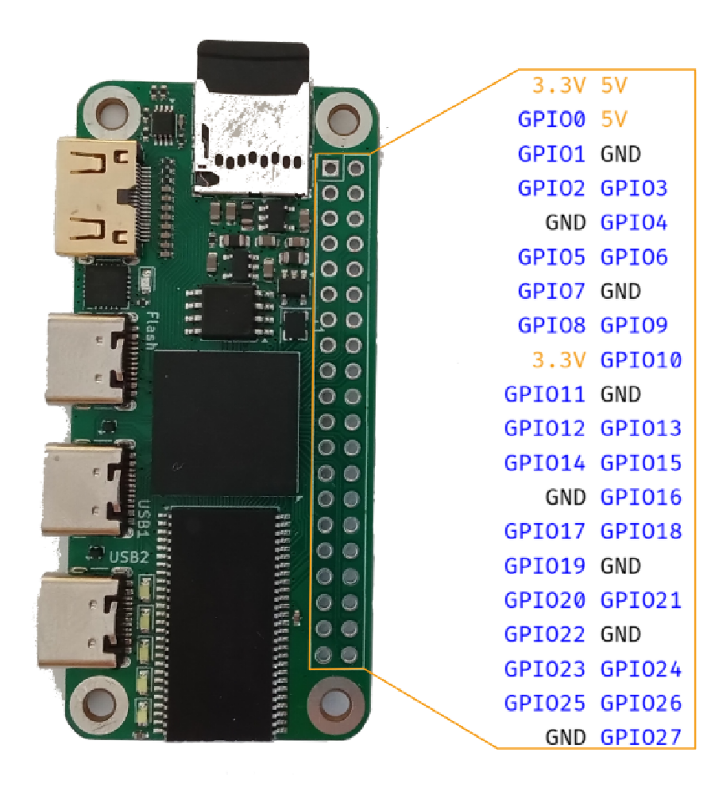
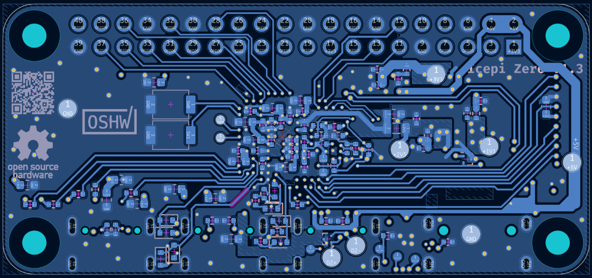

# Icedev Zero Firmware

## Table of Contents
- [Toolchain Setup](#toolchain-setup)
    - [Open Source Toolchain](#option-1-open-source-toolchain)
    - [Lattice Diamond](#option-2-lattice-diamond-ide)
- [Building Demos](#how-to-build-the-demos)
- [Flashing board](#how-to-flash)
- [Pinout](#pinout)
- [Linux on Litex SoC](#litex-soc)
- [More resources](#other-examples)

Welcome to the firmware folder! You can find numerous examples here:

- `blinky`: Classic LED counter!
- `counter`: Counter using the button as input :D
- `uart`: Uart transmission example
- `dvi`: GPDI example
- `usb`: USB examples
    - `usbmouse`: Shows a GPDI screen with an controllable mouse
- `third-party`: Third party verilog code
    - `memtest`: Memory tester w/ hdmi output! Pressing the button increases skew, middle row displays memory test cout, bottom row displays the number of bad memory reads.

## Toolchain setup

### Option 1: Open source toolchain

Download the latest build of the [OSS CAD Suite](https://github.com/YosysHQ/oss-cad-suite-build/releases/).

Unzip it anywhere and set shell command search path:
```
Linux              : export PATH=[path-to-bin]:$PATH
MacOS              : export PATH=[path-to-bin]:$PATH
Windows Powershell : $ENV:PATH = "[path-to-bin];" + $ENV:PATH
Windows cmd.exe    : PATH=[path-to-bin];%PATH%
```

### Option 2: Lattice Diamond IDE

To use the Diamond IDE, you must first request a license. (Free for individuals.)

Go to the [licensing page](https://www.latticesemi.com/Support/Licensing/DiamondAndiCEcube2SoftwareLicensing/DiamondFree?url=%2fSupport%2fLicensing%2fDiamondAndiCEcube2SoftwareLicensing%2fDiamondFree&tracker=login) and create an account. Then copy your device's MAC address, remove all colons and enter it into the "Host NIC" field. Click "Generate License". You should receive a license in your email after a few minutes.

After that, go to Diamond IDE's [download page](https://www.latticesemi.com/LatticeDiamond), install it following their instructions and select the license file when prompted.

You can now use Diamon IDE to create programs and flash it onto your Icepi with openFPGALoader!

Read more detailed instructions in the `DIAMOND.md` file.

## How to build the demos

Just `cd` into the directories, and type `make`!

- `make` runs `make debug`
- `make debug` installs the program to chip (bitstream is lost on power loss)
- `make install` installs the program to flash (bitstream is retained on power loss)
- `make install-bitstream` installs the `bitstream.bit` file to flash without rebuilding
- `make build` builds the bitstream (bitstream is retained on power loss)
- `make clean` deletes all the temporary files

## Make your own!

Just copy the `icepi-zero.lpf` and `Makefile` to the root of your directory, call your main module `top`, and you are good to go!

## How to flash

---
> An example bitstream file exists in the [documentation](../documentation/) folder.

The following command is used to flash the development board

```zsh
openFPGALoader -cft231X --pins=7:3:5:6 bitstream.bit
```

You can also add the `--write-flash` flag to permanantly write the bitstream to flash, this way the bitstream file will be saved even when the board powers down.

Note: If you use the newest version of openFPGALoader, it supports the `-b icepi-zero` flag that can replace `-cft231X --pins=7:3:5:6`.

Alternatively, you can use the web version of openFPGALoader on Google Chrome: [https://ofl.trabucayre.com/](https://ofl.trabucayre.com/).

Select "Default" as the cable and "icepi-zero" as the board, upload your .bit file and press Program.


Then select "FT231X USB UART" from the popup menu:


Now your board should be flashed! Happy hacking.

> Getting an error when flasing? Check out the [openFPGALoader troubleshooting](https://trabucayre.github.io/openFPGALoader/guide/troubleshooting.html) page.

## Pinout

The GPIO pinout is exactly the same as a [Pi Zero](https://pinout.xyz/):



You can find the name of rest of the I/O pins in `icepi-zero.lpf`:

- `gpio[27:0]`: gpio pins
- `led[4:0]`: User LEDs
- `button`: User button
- `gpdi_dp[3:0]`: GPDI interface
- `sdram_*`: SDRam interface
- `flash_*`: Flash interface
- `sd_*`: SDCard interface
- `usb_*`: FTDI/USB ports (UART/USB)
- `tp[1:0]`: Test points

Debug pins are distrubuted as the follwing picture shows:



## LiteX SoC

You can run a VexRiscv CPU (and Linux) on the Icepi Zero using [Litex](https://github.com/enjoy-digital/litex), @oliver408i wrote an [awesome guide](https://github.com/oliver408i/icepi-zero-litex) on how to use it!

## Other examples

This board is already supported by [apio](https://github.com/FPGAwars/apio/) and [icestudio](https://github.com/FPGAwars/icestudio)'s development branch. The board should be supported on stable in the next release.

The [litex-boards](https://github.com/litex-hub/litex-boards) also supports the Icepi Zero, while [linux-on-litex-vexriscv](https://github.com/litex-hub/linux-on-litex-vexriscv) has an pr open. (Forgot to open it last month, opps!)

And here are some retro ports:

- [Apple 1 Emulator](https://github.com/alangarf/apple-one)
- [Port of Acorn Atom](https://github.com/cheyao/acorn_atom)
- [Commodore 64!](https://github.com/cheyao/c64)
- [Oberon](https://github.com/cheyao/oberon)
- [Sega Master System](https://github.com/cheyao/sega-sms)
- [Port of Silice](https://github.com/sylefeb/Silice/) (Check out the projects folder - it's full of interesting programs)

